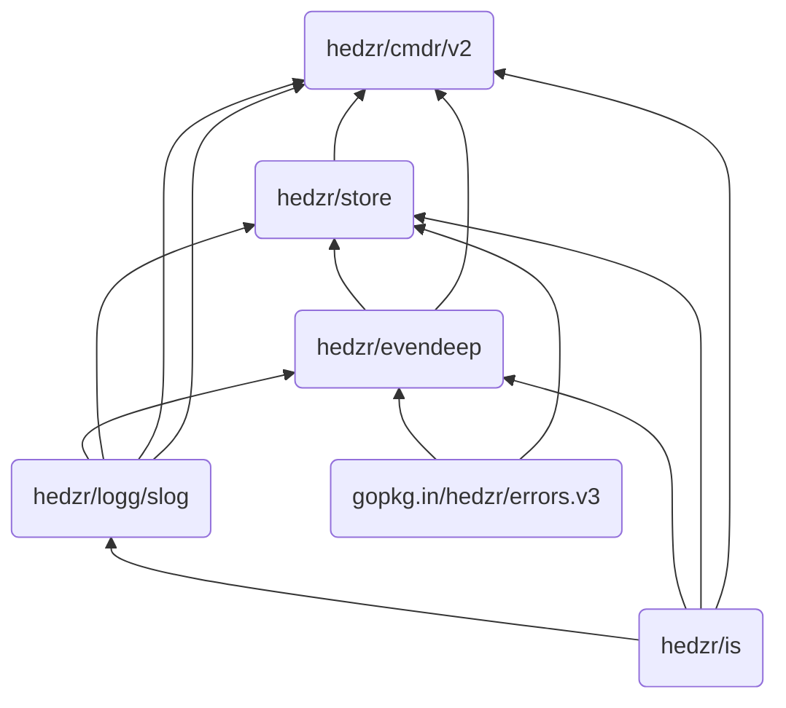

## Documentation

Welcome to the docs! Here is a manual about cmdr, which provides command-line argument parser to help your CLI app developing.

Writing a tiny CLI app with cmdr is easy. Here it is,

```go title="./examples/tiny0/main.go"
package main

import (
	"context"

	"github.com/hedzr/cmdr/v2"
	"github.com/hedzr/cmdr/v2/cli"
)

func main() {
	app := cmdr.New().
		Info("tiny0-app", "0.3.1").
		Author("The Example Authors") // .Description(``).Header(``).Footer(``)
	app.Cmd("jump").
		Description("jump command").
		Examples(`jump example`). // {{.AppName}}, {{.AppVersion}}, {{.DadCommands}}, {{.Commands}}, ...
		OnAction(func(ctx context.Context, cmd cli.Cmd, args []string) (err error) {
			println("jump command:", cmd)
			if cmd.FlagBy("full").GetTriggeredTimes() > 0 {
				// for dummy store, `if cmd.Store().MustBool("full") {}` cannot work
				println("Dump", cmd.Set().Dump()) // nothing to display since a dummy store created
			}
			return
		}).
		With(func(b cli.CommandBuilder) {
			b.Flg("full", "f").
				Default(false).
				Description("full option here").
				Build()
		})

	ctx := context.Background() // with cancel can be passed thru in your actions
	if err := app.Run(ctx); err != nil {
		println("Application Error:", err)
	}
}
```

Now let's run it,

```bash
$ go run ./examples/tiny0/

...[help screen ignored here]

$ go run ./examples/tiny0/ jump
jump command: (0x1024be4c0,0x140000766c8)

$ go run ./examples/tiny0/ jump --full
jump command: (0x1024be4c0,0x140000766c8)
Dump
```

The help screen looks like,


### Deeper In It

In this tiny app, we do not refer to a standard `Store`, so a dummy one was created internally, which would discard any requests.

Due to the reason, The call to `cmd.Store().MustBool("full")` cannot return the proper value input by end user. So the replacement is, detecting the hit times of `full` in parsing will tell us that `--full` or `-f` had been typed on command line.

> `cmdr.ParsedState()` will provides the details of parsing state.
> But it's not used here.

As a fact, when user typed `app --full -f`, the hit times would be 2.

`cmd.FlagBy("full")` could locate to the right `*Flag` object by it long-title.
Similarly, `cmd.SubCmdBy("xxx")` could be used for look up a subcommand.

Both of them are searching for the child directly. But if you want the descendant children recursively, `cmd.(*cli.CmdS).FindSubCommandRecursive(ctx, longTitle, wide)` can do it. The functions include:

- `FindSubCommand`
- `FindSubCommandRecursive`
- `FindFlag`
- `FindFlagRecursive`

As the methods of `*cli.CmdS`, they aren't exposed on `interface Cmd` currently. So it might need a `Type Assertion` before you can access them.

## Design

`cmdr.v2` takes these dependencies:

- `hedzr/store`[^1]
- `hedzr/evendeep`[^2]
- `hedzr/logg`[^3]
- `hedzr/is`[^4]
- `hedzr/errors` (`gopkg.in/hedzr/errors.v3`)

Also `cmdr.v2` refers to go stdlib and golang.org/x libraries.

In generally, we do not refer to other third-party libraries.

But here's a exception while you're using `hedzr/store` and `hedzr/cmdr-loaders` for loading the external configuration files/sources. For parsing the file format such as TOML and YAML, we need those common libraries, for example, `gopkg.in/yaml.v3`, and so on.

`cmdr.v2` try to make the dependencies more concise. This would provide a simple supplier chain to you.

All of apps based on `cmdr.v2` have a builtin command `sbom` to print the supplier information chain with YAML-friendly format.



## Learn More

<Cards>
  <Card title="Cmdr(-go) v2 Documentation" href="./cmdr.v2/" />
  <Card title="Cmdr(-go) v1 Documentation" href="./cmdr.v1/" />
  <Card
    title="Learn more about `hedzr/store`"
    href="https://github.com/hedzr/store"
  />
  <Card
    title="Learn more about `hedzr/evendeep`"
    href="https://github.com/hedzr/evendeep"
  />
  <Card
    title="Learn more about `hedzr/logg`"
    href="https://github.com/hedzr/logg"
  />
  <Card
    title="Learn more about `hedzr/is`"
    href="https://github.com/hedzr/is"
  />
</Cards>

## Footnotes

[^1]: `hedzr/store` is a high-performance configure management library

[^2]: `hedzr/evendeep` offers a customizable deepcopy tool to you. There are also deepequal, deepdiff tools in it.

[^3]: `hedzr/logg` provides a slog like and colorful logging library

[^4]: `hedzr/is` is a basic environ detectors library
