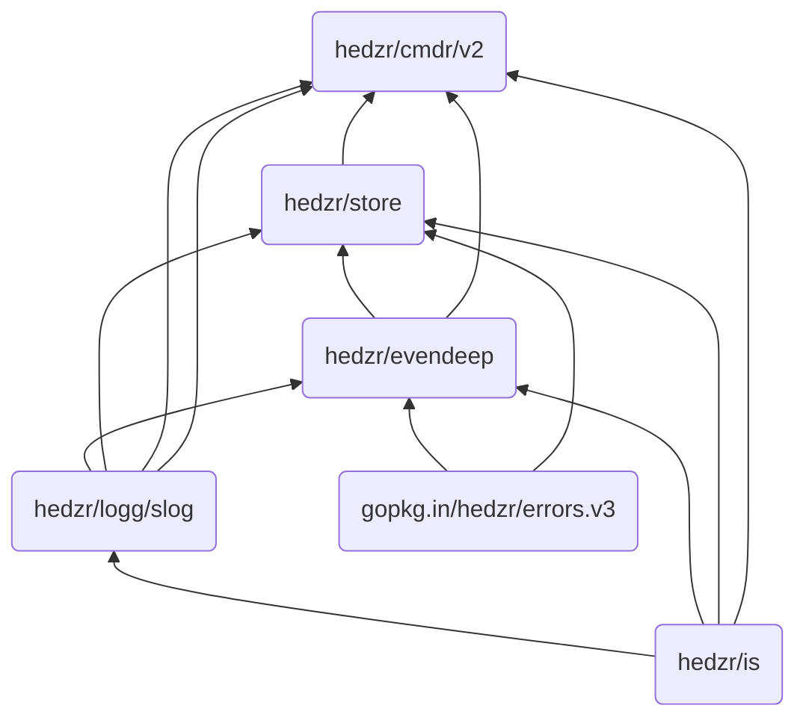

## 了解 cmdr

所以这里是 `cmdr(-go)` 的相关文档。

<Cards>
  <Card title="Cmdr(-go) v2 Documentation" href="./cmdr.v2/" />
  <Card title="Store Documentation" href="./store/" />
  <Card title="EvenDeep Documentation" href="./evendeep/" />
  <Card title="Logg/slog Documentation" href="./logg/" />
  <Card title="Is Documentation" href="./is/" />
  <Card title="Cmdr(-go) v1 Documentation" href="./cmdr.v1/" />
</Cards>

用 Golang 编写一个使用 cmdr 软件包的微型 app，可以是这样，

```go title="./examples/tiny0/main.go"
package main

import (
	"context"

	"github.com/hedzr/cmdr/v2"
	"github.com/hedzr/cmdr/v2/cli"
)

func main() {
	app := cmdr.New().
		Info("tiny0-app", "0.3.1").
		Author("The Example Authors") // .Description(``).Header(``).Footer(``)
	app.Cmd("jump").
		Description("jump command").
		Examples(`jump example`). // {{.AppName}}, {{.AppVersion}}, {{.DadCommands}}, {{.Commands}}, ...
		OnAction(func(ctx context.Context, cmd cli.Cmd, args []string) (err error) {
			println("jump command:", cmd)
			if cmd.FlagBy("full").GetTriggeredTimes() > 0 {
				// for dummy store, `if cmd.Store().MustBool("full") {}` cannot work
				println("Dump", cmd.Set().Dump()) // nothing to display since a dummy store created
			}
			return
		}).
		With(func(b cli.CommandBuilder) {
			b.Flg("full", "f").
				Default(false).
				Description("full option here").
				Build()
		})

	ctx := context.Background() // with cancel can be passed thru in your actions
	if err := app.Run(ctx); err != nil {
		println("Application Error:", err)
	}
}
```

运行的效果为，

```bash
$ go run ./examples/tiny0/

...[help screen ignored here]

$ go run ./examples/tiny0/ jump
jump command: (0x1024be4c0,0x140000766c8)

$ go run ./examples/tiny0/ jump --full
jump command: (0x1024be4c0,0x140000766c8)
Dump
```

The help screen looks like,


### 额外的话题

在这个微型示例程序中，我们没有使用标准的 `Store`，因此 cmdr 自行创建了一个隐含的 DummyStore，它废弃一切进入的操作。
也因此 `cmd.Store().MustBool("full")` 无法取得 `--full` 的用户输入值。
为此这里使用了变通的办法：通过检测 full 的 \*Flag 对象被终端用户触发的次数来确定它已经被输入了。
如果用户在命令行输入了 `--full -f`，则触发次数将会是 2。

`cmd.FlagBy("full")` 可以按照选项参数的长标题来找到对应的 \*Flag 对象。
类似地，`cmd.SubCmdBy("xxx")` 可以用来找到子命令。
这两者都是非递归的。

如果你想递归向下查找，`cmd.(*cli.CmdS).FindSubCommandRecursive(ctx, longTitle, wide)` 可以做到。这组函数有，

- `FindSubCommand`
- `FindSubCommandRecursive`
- `FindFlag`
- `FindFlagRecursive`

它们在 `*cli.CmdS` 上提供，但目前没有在 `interface Cmd` 上提供，所以可能你需要一个 Type Assertion 进行转换。

## Learn More

<Cards>
  <Card
    title="Learn more about `hedzr/store`"
    href="https://github.com/hedzr/store"
  />
  <Card
    title="Learn more about `hedzr/evendeep`"
    href="https://github.com/hedzr/evendeep"
  />
  <Card
    title="Learn more about `hedzr/logg`"
    href="https://github.com/hedzr/logg"
  />
  <Card
    title="Learn more about `hedzr/is`"
    href="https://github.com/hedzr/is"
  />
  {/* <Card title="Learn more about Fumadocs" href="https://fumadocs.vercel.app" /> */}
</Cards>

## Design

`cmdr.v2` 依赖这些基础库：

- `hedzr/store`[^1]
- `hedzr/evendeep`[^2]
- `hedzr/logg`[^3]
- `hedzr/is`[^4]
- `hedzr/errors` (`gopkg.in/hedzr/errors.v3`)

除此之外，`cmdr.v2` 主要依赖于 Go 标准库或者 golang.org 的扩展库。

通常情况下 `cmdr.v2` 不依赖其他第三方库，但当你使用 `hedzr/Store` 和 `hedzr/cmdr-loader` 来加载外部配置文件时，则一些通用第三方库将会被加入到依赖表。典型的例子是 toml，yaml 等格式解析库。

`cmdr.v2` 尽可能是依赖关系简明化，以便能向你提供清晰的供应链清单。

所有的基于 `cmdr.v2` 的 app 都包含内建命令 `sbom` 来打印一个 YAML 格式的供应链数据集以供整合与审查。



## Footnotes

[^1]: `hedzr/store` is a high-performance configure management library

[^2]: `hedzr/evendeep` offers a customizable deepcopy tool to you. There are also deepequal, deepdiff tools in it.

[^3]: `hedzr/logg` provides a slog like and colorful logging library

[^4]: `hedzr/is` is a basic environ detectors library
