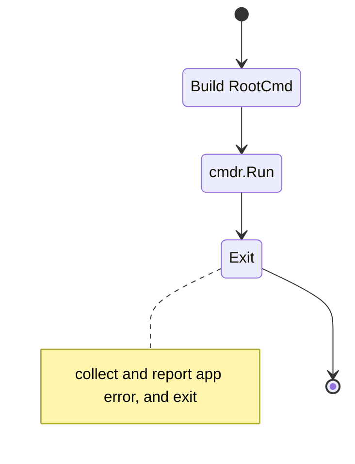
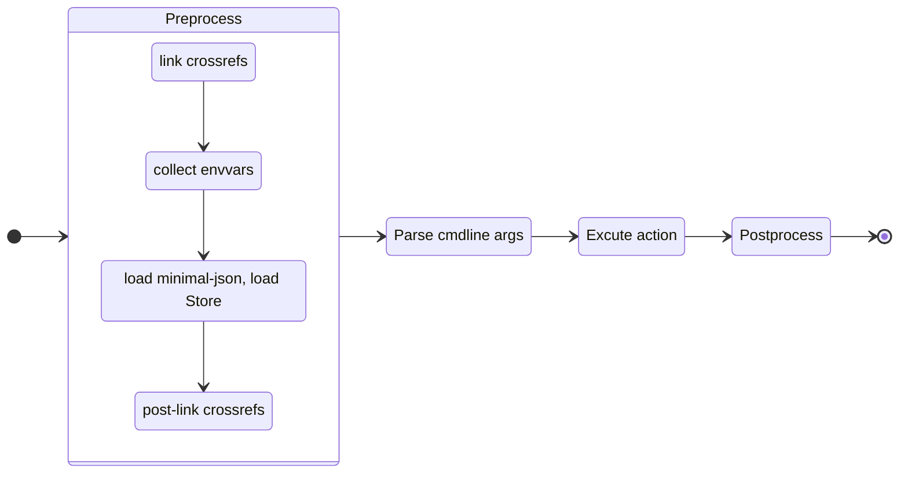

## 运行方式

### Main Loop

### cmdr `Run` Workflow

### 额外的话题

<Cards>
  <Card title="With Options" href="../g71-with-options" />
  <Card title="Package Level Functions" href="../g70-package-level-functions" />
</Cards>

## Links

- [Mermaid](/docs/internal-tests/tests/mermaid/)
