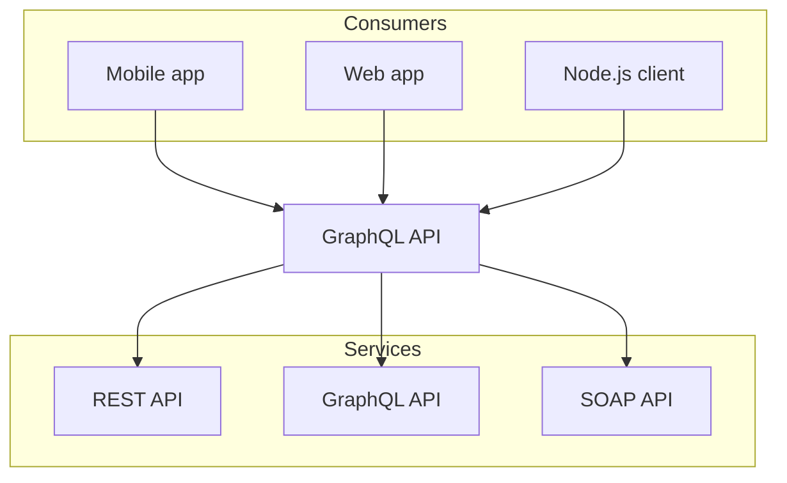
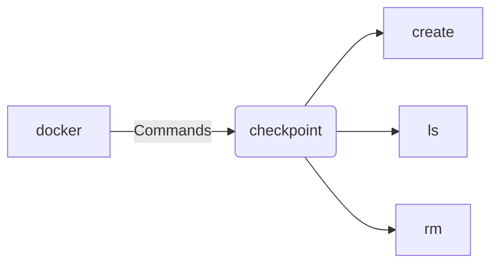

<InlineTOC defaultOpen open disabled items={toc} />

## Sample

1Mermaid

```mermaid
graph TD;
    A-->B;
    A-->C;
    B-->D;
    C-->D;
```

2Mermaid

```mermaid
graph TD;
subgraph AA [Consumers]
A[Mobile app];
B[Web app];
C[Node.js client];
end
subgraph BB [Services]
E[REST API];
F[GraphQL API];
G[SOAP API];
end
Z[GraphQL API];
A --> Z;
B --> Z;
C --> Z;
Z --> E;
Z --> F;
Z --> G;
```

3Mermaid

```mermaid
graph LR
A[docker] -->|Commands| B(checkpoint)
B --> D[create]
B --> E[ls]
B --> F[rm]
```
