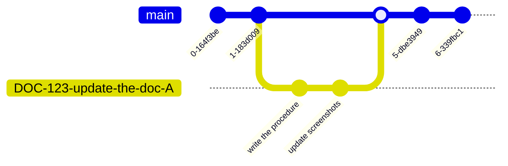

<InlineTOC defaultOpen open disabled items={toc} />

## Sample

### 1, Mermaid


### 2, Mermaid


### 3, Mermaid


### Query Info

Mermaid-(js) version is:

```mermaid
  info
```

## more

### sequence diagram


### state diagram


### git graph



### flowchart


## geojson & topjson

[创建 GeoJSON 和 TopoJSON 地图](https://docs.github.com/zh/get-started/writing-on-github/working-with-advanced-formatting/creating-diagrams#creating-geojson-and-topojson-maps) 不被支持。

````markdown
```geojson
{
  "type": "FeatureCollection",
  "features": [
    {
      "type": "Feature",
      "id": 1,
      "properties": {
        "ID": 0
      },
      "geometry": {
        "type": "Polygon",
        "coordinates": [
          [
            [
              -90,
              35
            ],
            [
              -90,
              30
            ],
            [
              -85,
              30
            ],
            [
              -85,
              35
            ],
            [
              -90,
              35
            ]
          ]
        ]
      }
    }
  ]
}
```
````

## Links

- [Backstage](/docs/cmdr.v2/concepts/g80-backstage/)

```

```
