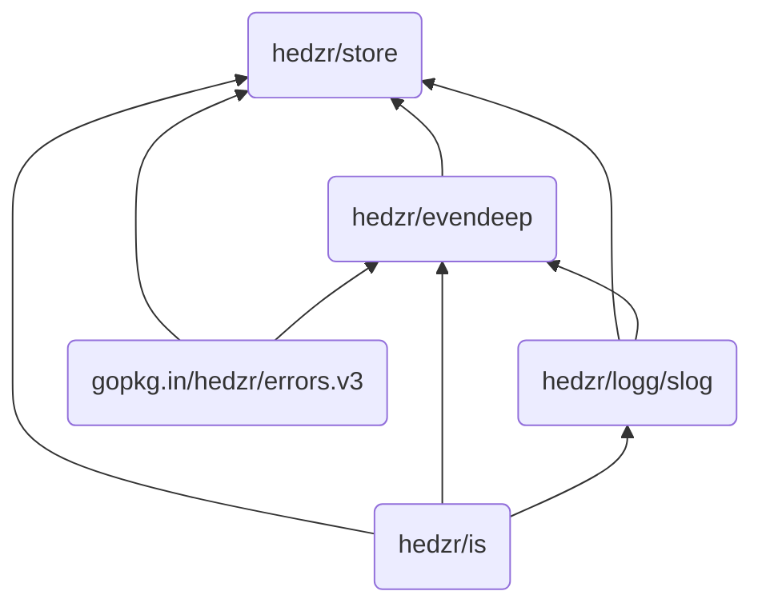

## Intro to Store

[`hedzr/Store`](https://github.com/hedzr/store) provides an extensible, high-performance configuration management library. It is optimized for accessing hierarchical data.

The special is `put any data and extract typed it`. Which means, the `store` will try to convert the source data within underlying.

Another feature is the `store` traces config items' modification states. So you can extract the changed subset. See also [Modified State](#modified-state).

The `store` is designed to provide the basic skeleton for [hedzr/cmdr v2 (RC1 released)](https://github.com/hedzr/cmdr). It also could be used as a standalone config manager. We split the original config (called as option-store at cmdr v1) and rewrote it. In the refactoring phrase, some excellent config-mgmt/centers get many tips to us, such as [koanf](https://github.com/knadh/koanf) and [viper](https://github.com/spf13/viper). Many respects.

The `store` accesses tree data with a dotted key path, that means you may point to a specified tree node and access it, modify it, monitor it or remove it. You can use a different delimiter char like `/` or `\`.

```go
conf := store.New()
conf.Set("app.debug", false)
conf.Set("app.verbose", true)
conf.Set("app.dump", 3)
conf.Set("app.logging.file", "/tmp/1.log")
conf.Set("app.server.start", 5)

ss := conf.WithPrefix("app.logging")
ss.Set("rotate", 6)
ss.Set("words", []any{"a", 1, false})
ss.Set("keys", map[any]any{"a": 3.13, 1.73: "zz", false: true})

// Tag, Comment & Description
conf.Set("app.bool", "[on,off,   true]")
conf.SetComment("app.bool", "desc: a bool slice", "cmmt: remarks here")
conf.SetTag("app.bool", []any{"on", "off", true})
// println(conf.MustGetTag("app.bool"))
// println(conf.MustGetComment("app.bool"))

radix.StatesEnvSetColorMode(true) // to disable ansi escape sequences in dump output
_, _ = fmt.Println(conf.Dump())   // inspect it

conf.GetEx("app.bool", func(node radix.Node[any], data any, branch bool, kvpair radix.KVPair) {
  println(node.Comment())
})
conf.Update("app.bool", func(node radix.Node[any], old any) {
  node.SetComment("a bool slice", "remarks here")
})

// TTL to clear the node data to zero
conf.SetTTL("app.bool", 3*time.Second, func(_ *radix.TTL[any], nd radix.Node[any]) {
  log.Printf("%q (%v) cleared", "app.bool", nd.Data())
})  // since v1.2.5
defer conf.Close()  // when you used SetTTL, the Close() is must be had.

// Set/create a node at once by SetEx()
conf.SetEx("app.logging.auto-stop", true,
  func(path string, oldData any, node radix.Node[any], trie radix.Trie[any]) {
    trie.SetTTL(path, 30*time.Minute,
      func(s *radix.TTL[any], node radix.Node[any]) {
          trie.Remove(node.Key()) // erase the key with the node
      })
    // Or:
    trie.SetTTLFast(node, 39*time.Second, nil)
    // Or:
    node.SetTTL(39*time.Second, trie, nil)
  })
```

The dumping result looks like (internal data structure):

```text
  app.                          <B>
    d                           <B>
      ebug                      <L> app.debug => false
      ump                       <L> app.dump => 3
    verbose                     <L> app.verbose => true
    logging.                    <B>
      file                      <L> app.logging.file => /tmp/1.log
      rotate                    <L> app.logging.rotate => 6
      words                     <L> app.logging.words => [a 1 false]
      keys                      <L> app.logging.keys => map[a:3.13 1.73:zz false:true]
    server.start                <L> app.server.start => 5
    bool                        <L> app.bool => [on,off,   true] // remarks here | tag = [on off true] ~ a bool slice
```

As you seen, the internal structure will be printed out for the deep researching.


> `<B>` is branch, `<L>` is leaf.
>
> Leaf node contains data, comment, description and tag (any value).
>
> To speed up the tree, any delimiter char is a part of the path.

The `store` provides advanced APIs to extract the typed data from some a node,

```go
iData := conf.MustInt("app.logging.rotate")
stringData := conf.MustString("app.logging.rotate")
debugMode := conf.MustBool("app.debug")
...
```

The searching tools are also used to locate whether a key exists or not:

```go
found := conf.Has("app.logging.rotate")
node, isBranch, isPartialMatched, found := conf.Locate("app.logging.rotate")
t.Logf("%v | %s | %v |     | %v, %v, found", node.Data(), node.Comment(), node.Tag(), isBranch, isPartialMatched, found)
```

`Locate()` is a more friendly `Has()` test for the developers when they want to inspect more extra information after searching.

For more information, browse these public sites:

- https://pkg.go.dev/github.com/hedzr/store
- https://github.com/hedzr/store
- Check out the codes in test source files

To see the recently changes at [CHANGELOG](https://github.com/hedzr/store/blob/master/CHANGELOG).

> Since v1.1.0, unexported struct ptr (\*storeS) removed from `Store` API.
>
> These apis changed to:
>
> - `Clone() (newStore Store)`
> - `Dup() (newStore Store)`
> - `WithPrefix(prefix ...string) (newStore Store)`
> - `WithPrefixReplaced(newPrefix ...string) (newStore Store)`
>
> Since v1.2.0, the prototypes of `Locate`/`Query` are changed.
>
> - an extra `kvpair` will be returned if there is `:ident` in trie path and matched ok.
> - support these url var matching: "/:id/", "/\*filepath"
>
> For example, matching `/hello/bob` on a router path pattern `/hello/:name` will get `kvpair = {"name":"bob"}`, and `/search/any/thing/here` on pattern `/search/*keywords` will get `kvpair = {"keywords":"any/thing/here"}`.
>
> Since v1.2.5, `SetTTL(path, ttl, callback)` added.  
> Since v1.2.8, `SetTTLFast(node, ttl, callback)` added.  
> Since v1.2.8, `SetEx(path, val, callback)` added.  
> Since v1.3.0, move the minimal toolchain to go1.23.7.

Using store as the core of a http router is possible. Since v1.2 we added builtin http route param support (like `:user`).

Using [hedzr/store](https://github.com/hedzr/store) as a in-memory Cache provider is possible. Since v1.2.5 we added `SetTTL` to reset the data of a node (by key) to zero value. You can inject your codes to drop the key or whatever else.

## Benchmarks

The `store` is designed to reduce the allocations much better, and up the performance much better. We have a zero-allocation implementation in reading a key-value pair, currently.

Our benchmark testing (`test/bench_test.go`) shows:

```bash
goos: darwin
goarch: amd64
pkg: github.com/hedzr/store/tests
cpu: Intel(R) Core(TM) i9-9880H CPU @ 2.30GHz
BenchmarkTrieSearch
BenchmarkTrieSearch/hedzr/storeT[any]
BenchmarkTrieSearch/hedzr/storeT[any]-16             59983291            18.99 ns/op           0 B/op           0 allocs/op
BenchmarkTrieSearch/hedzr/store
BenchmarkTrieSearch/hedzr/store-16                   60454639            19.43 ns/op           0 B/op           0 allocs/op
PASS
```

Some control groups with the same executive environment produced:

```bash
...
BenchmarkTrieSearch/kzzzz
BenchmarkTrieSearch/kzzzz-16                         46264582            28.88 ns/op          16 B/op           1 allocs/op
BenchmarkTrieSearch/vzzzz
BenchmarkTrieSearch/vzzzz-16                         22824562            51.21 ns/op          32 B/op           2 allocs/op
...
```

> 1. To avoid controversy, pkg-name masked.
> 2. Both of these testing data sets have the same scale basically (lower than 20 keys). Also, the querying words are same.
>
>    
>
> 3. No Warrenties.

The performance benefits mainly from the refresh implemented about our internal Trie-tree (radix-tree).

As an addition, here are huger/larger benches:

```bash
    bench_test.go:82: kxxxx/Large keys: 40 keys
    bench_test.go:52: store/Large keys: 48 keys
    bench_test.go:24: kxxxx/Huge keys: 318 keys
    bench_test.go:26: store/Huge keys: 422 keys

BenchmarkTrieSearch/hedzr/store
BenchmarkTrieSearch/hedzr/store-16               	57905116	        20.23 ns/op	       0 B/op	       0 allocs/op
BenchmarkTrieSearch/hedzr/store/Large
BenchmarkTrieSearch/hedzr/store/Large-16         	12816524	        82.66 ns/op	     240 B/op	       0 allocs/op
BenchmarkTrieSearch/hedzr/store/Huge
BenchmarkTrieSearch/hedzr/store/Huge-16          	12987994	        89.08 ns/op	     224 B/op	       0 allocs/op
BenchmarkTrieSearch/kxxxx
BenchmarkTrieSearch/kxxxx-16                     	64279840	        19.54 ns/op	       7 B/op	       0 allocs/op
BenchmarkTrieSearch/kxxxx/Large
BenchmarkTrieSearch/kxxxx/Large-16               	 1476079	       838.0 ns/op	     710 B/op	      18 allocs/op
BenchmarkTrieSearch/kxxxx/Huge
BenchmarkTrieSearch/kxxxx/Huge-16                	 1678077	       739.9 ns/op	     441 B/op	      12 allocs/op
```

You can find out that our `store` has a better score while working on a large configuration set,
although it might take more latency than on a tiny set.

> The datasource of huge test is a pet-store openapi swagger doc, coming from https://editor.swagger.io/.
> With a same input like a YAML file, the `store` could get more key-value pairs because `store.WithStoreFlattenSlice(true)` applied, which will expand slices and maps in a value as nested key-value pairs.

So that's it.

## Dependencies

The `store`[^1] imports some modules of mine:

1. [`hedzr/evendeep`[^2]]
2. [`hedzr/logg/slog`[^3]]
3. [`hedzr/errors.v3`[^4]]
4. [`hedzr/is`[^5]]

The dependency graph is:



[^1]: `hedzr/store` is a high-performance configure management library

[^2]: `hedzr/evendeep` offers a customizable deepcopy tool to you. There are also deepequal, deepdiff tools in it.

[^3]: `hedzr/logg` provides a slog like and colorful logging library

[^4]: `hedzr/errors.v3` provides some extensions and compatible layer over go1.11 ~ nowadays.

[^5]: `hedzr/is` is a basic environ detectors library

## LICENSE

Apache 2.0
